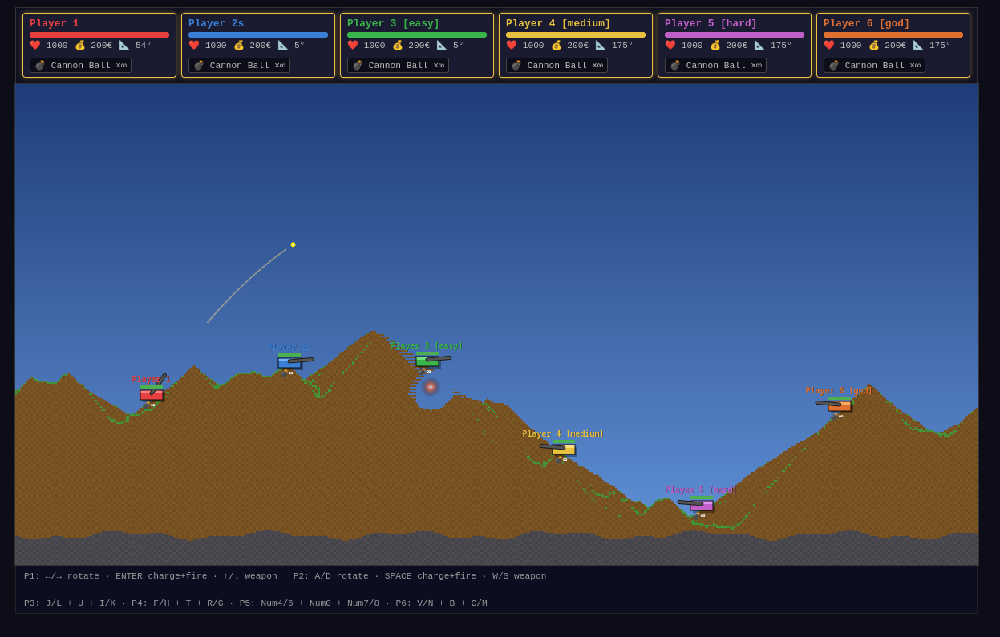

# Feuerpanzerkampf

[](https://doofmars.github.io/feuerpanzerkampf/)

Feuerpanzerkampf is a browser artillery game inspired by Scorched Earth / Worms with destructible sand-style terrain, local + online multiplayer, and a between-round economy/shop loop.

## Features

- 1200×600 canvas game world (600×300 simulation grid, 2× render scale)
- Cellular sand physics terrain with gravity-driven collapse
- Terrain material layers: grass, soil, bedrock
- 8 playable weapons:
  - Cannon Ball (unlimited)
  - Rocket
  - Acid Bomb
  - Snow Ball
  - Gun Shot
  - Laser
  - Cluster Bomb
  - Shield
- Local multiplayer up to 6 players
- Online room multiplayer via Socket.io
- Round-based economy + shop
- Optional unlimited-ammo mode
- Optional bot players by naming a player with a difficulty tag:
  - `[easy]`, `[medium]`, `[hard]`, `[expert]`, `[god]`

## Controls

- **Player 1**: `←/→` rotate · `ENTER` fire/charge · `↑/↓` weapon
- **Player 2**: `A/D` rotate · `SPACE` fire/charge · `W/S` weapon
- **Player 3**: `J/L` rotate · `U` fire · `I/K` weapon
- **Player 4**: `F/H` rotate · `T` fire · `R/G` weapon
- **Player 5**: `Numpad4/6` rotate · `Numpad0` fire · `Numpad7/8` weapon
- **Player 6**: `V/N` rotate · `B` fire · `C/M` weapon

Gun Shot and Laser fire instantly (no charge hold required).

## Run locally

```bash
npm install
npm start
```

Then open:

- `http://localhost:3000`

## Tech stack

- Node.js
- Express
- Socket.io
- Vanilla JavaScript + HTML5 canvas
